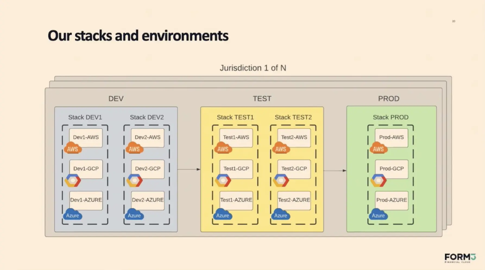

# 跨云应用管理平台

## Google Cloud Athos

>https://cloud.google.com/anthos/docs/concepts/overview

Anthos 是一个现代应用管理平台，可为云端和本地环境提供一致的开发和运营体验。

## 自建服务

目前我觉得使用如下方式是比较合适的：

- 使用 cluster-api 管理多集群的创建、更新、维护等
- 使用 Terraform/Pulumi 来管理所有云上资源，并充分利用 Git 进行配置的版本控制与 Review.
- 控制面集群可以考虑直接使用 kind 等工具实现更灵活小巧、易于迁移的部署方式，不需要用 cluster api
- Istio 多集群模式
  - 对于 Istio 多集群，考虑到其复杂性，可以考虑购买 solo.io/Tetrate 的 Istio 商业支持，以获得最专业的帮助。
- 使用 Karmada 实现服务的多集群部署
  - 对于服务的多环境部署如 dev/test/prod，为了实现多用户互不干扰地开发测试，dev/test 两个环境要抽象出一个 stack 的概念（即一个单独的、隔离的服务组），不同的用户可以自行部署自己的 stack，可以考虑每个 stack 使用一个单独的名字空间。
- 使用 Flagger/ArgoRollouts 渐进式发布
  - 这两个工具可能不适合多集群切量的场景，需要定制或者独立开发
- 使用 KEDA 替代 HPA 实现实例扩缩容
- 考虑直接使用云无关的网络插件：cilium
- 使用 kubecost 计算成本
- 跨云消息传递：[NATS](https://github.com/nats-io/nats-server) + CloudEvents
  - NATS 支持跨云部署，将某一朵云或者本地数据中心作为主集群，其他云上部署一个叶集群

多云环境下 dev/test 的多 stack 示意图：

