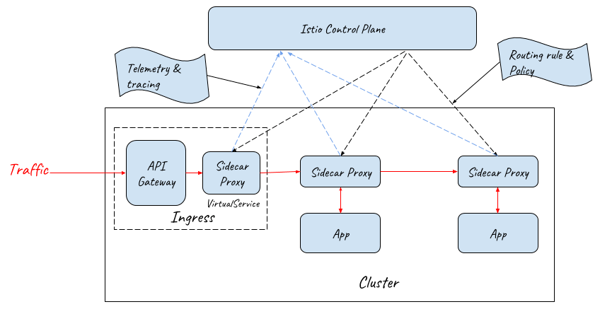

# Ingress - 入口网关

>网关如何暴露到集群外部：[kubernetes 如何将服务暴露到外部](../kubernetes%20如何将服务暴露到外部.md)

## 基础概念

网关 Gateway，就是指一个流量的集中式出入口，网关有两种类型：

1. Ingress Gateway: 入网网关，所有请求都应该从这里进入集群。
2. Egress Gateway: 出口网关，顾名思义，它用于控制所有从集群出去的流量。

对于一个独立的网络，我们通常对入口的管控要求比较严格，而对出口的要求不高，Kubernetes 原生也没有提供 Egress Gateway 这项功能。
我想到的几个原因如下：

1. 技术问题：目前已有的方案里，只有通过服务网格，才能实现 Egress Gateway, 比如 Istio.
2. 成本问题：前面讲了添加 Egress Gateway 需要 Istio，这会带来性能下降。
3. 繁琐程度：Egress Gateway 要求声明好所有需要访问的外部服务，比较繁琐。
4. 懒？：很多人觉得内网已经足够安全了，只要在入口安全性做好了，内网是安全的，出口就不需要管控。

## 一、Ingress / API Gateway

Ingress 是 Kubernetes 中目前最成熟的入口网关资源，但是它的设计比较有局限性，许多能力都得通过 annotation 提供支持。

而 API Gateway 是一个通用的概念，指功能更丰富的入口网关。
具体而言，API Gateway 就是比普通的网关多干了一些以前我们在应用内部实现的事：身份认证，权限控制，基于来源的流量控制，日志服务等等。

>目前官方开发了新一代的网关资源：Gateway API，目前已进入阶段，正在如火如荼地落地中。

Ingress 资源对应的控制器被称作 Ingress Controller，它负责使集群状态符合 Ingress 资源的描述。
但是现代 Kubernetes 集群中，我们常用的网关会更符合 API Gateway 的定义，功能要比 Ingress 这个官方资源的定义强很多，通常都使用 CRD 来实现。

这里着重介绍几个比较流行的社区实现，它们大都提供了一些更高级的特性，比如 JWT 身份验证、来源限流、或者直接提供了插件系统。

>可以在 [API Gateway - CNCF Cloud Native Landscape](https://landscape.cncf.io/card-mode?category=api-gateway&grouping=category) 中找到几乎所有流行的云原生 API 网关。

这样网关大都基于 Nginx/Openresty 或者 Envoy 实现，只有少部分网关是使用 Go/Java 等语言完全重新造的轮子。
其中 Nginx/Openresty 凭借其极高的性能与可拓展性占据一席之地，而 Envoy 则凭借其丰富的功能与面向云原生的设计占据了云原生领域的半壁江山。

>Nginx 在很长一段时间内都是 L7 负载均衡领域的王者，但是随着云计算的发展，企业对 API 网关的需求越来越强烈，开源 Nginx 本身渐渐无法满足需求。
最大的问题是 Nginx 的配置比较复杂，而且不够动态，无法满足 Kubernetes 网关以及其他场景的需要。而新一代 API 网关则瞄准了这一需求，提供基于 API 的动态配置方式，内置网关常用的所有能力，赢得了许多用户的喜爱。

基于 Envoy 实现的 API 网关：

- Istio IngressGateway
  - Istio 服务网格的原生网关，基于 Envoy 开发
- https://github.com/solo-io/gloo
  - gloo 公司是 Istio 社区的核心贡献者之一，很活跃。
- https://github.com/projectcontour/contour
- https://github.com/emissary-ingress/emissary

基于 Ngninx/Openresty 实现的 API 网关：

- APISIX：国产项目，完全开源，借鉴了 Kong 的方案，但是官方宣称性能更好，架构更优。
  - APISIX 及其插件是完全开源的，而且功能非常丰富，作为网关用感觉很合适，可以考虑跟 Istio 服务网格结合使用。
- Kong：国外老牌项目，部分关键插件是收费的。
  - Kong 跟 APISIX 都是完全基于 Nginx/Openresty 实现的，但是 Kong 更偏商业化一些，许多插件都是收费的...
  - 根据我的简单压测，APISIX 的性能要略优于 Kong，尤其是 Kong 的部分插件性能比较差，这个好像都比较知名了，很多人都清楚 Kong 的插件性能问题...

其他 API 网关：

- https://github.com/traefik/traefik
- https://github.com/megaease/easegress
- https://github.com/apioak/apioak
- https://github.com/luraproject/lura
- https://github.com/TykTechnologies/tyk
- https://github.com/alibaba/Sentinel

说实话感觉网关太多了，有点眼花缭乱，不太好选。

## 二、Ingress / API Gateway 与服务网格集成 {#api-gateway-plus-service-mesh}

>这里仅讨论如何将第三方网关跟服务网格集成，Istio 自带的 Ingress 就略过不讨论了，想研究 Istio IngressGateway 请移步 [/kubernetes/service_mesh/istio/Ingress.md](/kubernetes/service_mesh/istio/Ingress.md).

将 Ingress / API Gateway 与 Istio 等服务网格集成的最佳方法，就是把 Ingress 也当成一个普通服务来处理，注入一个 Sidecar Proxy，[如何为服务网格选择入口网关？ - 赵化冰](https://zhaohuabing.com/post/2019-03-29-how-to-choose-ingress-for-service-mesh/) 里给的架构图如下：

虽然此方案在 Gateway 旁边加了一个 Sidecar Proxy，但是它使任何 API Gateway 都能直接无痛接入 Istio 服务网格，哪怕这个网关是一个原始的基于配置文件的 Nginx 容器！都能直接利用上服务网格的 L7 负载均衡、流量分配、故障注入等等能力。

如果你们以前使用的是将 Nginx 部署在虚拟机上的方案，那么改造的第一步，就应该是将 Nginx 放在 Kubernetes 集群里部署并扩缩容，并且注入 Sidecar Proxy 以接入 Istio 服务网格，而外部则可通过云服务商的 L4 负载均衡、或者自建 keepalived(vrrp+ipvs) 对外提供高可用的静态公网 IP。

架构图如下：

```mermaid
flowchart LR
    C[Client] -->|Traffic| L4[L4 Proxy] --> G(Nginx Gateway)
    G --> P[Sidecar Proxy]
    P --> P_A[Sidecar Proxy] <--> A[Service A]
    P_A <---> P_D[Sidecar Proxy] <--> D[Service D]
    P --> P_B[Sidecar Proxy] --> B[Service B]
    subgraph Kubernetes
        subgraph Nginx Pod
        G
        P
        end
        subgraph Pod A
        A
        P_A
        end
        subgraph Pod D
        D
        P_D
        end
        subgraph Pod B
        B
        P_B
        end
    end
```