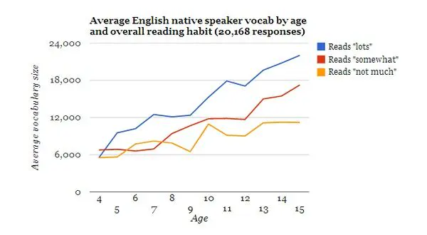

>原文：https://zhuanlan.zhihu.com/p/19764780

>编辑于 2018-11-16 21:59

想增加词汇量，非撸小说不可

PS，1W词汇量不过是国外8-9岁小孩的平均水平，你们颤抖了么？

Reading habits

09 May 2013

We now have data to answer another one of the new questions we introduced almost two years ago. This time it's correlation between reading habits and vocabulary size for native English speakers, by age:

This is an extremely fascinating chart, because it reveals what we've thought all along — reading builds your vocabulary. However, we never dreamed that the final chart would look quite so "clean"! (At least, ignoring the bottom-most line for now.) Of course, when you have more than a quarter million respondents, that lets you produce pretty accurate results.

We have three main findings from this chart. The first is that while increasing your reading matters, increasing your reading of fiction, specifically, matters equally as much. That ficion reading would increase vocabulary size more than just non-fiction was one of our hypotheses — it makes sense, after all, considering that fiction tends to use a greater variety of words than non-fiction does. However, we hadn't expected its effect to be this prominent.

The second finding is that, for people who already read "somewhat", then for each level of "bumping up" their reading in general, or of fiction specifically, their vocabulary will be roughly 2,000 words larger. Indeed, the difference between someone who reads "somewhat" and fiction "not much", and someone who reads "lots" and fiction "lots", is approximately 8,000 words, regardless of age level. That's a huge difference.

[The numbers for people who read "not much" are far lower, and seem to follow a different curve entirely. Indeed, the lowest percentiles of vocabulary size in our survey overall show drastically different results. We believe this is due to a combination of 1) insufficient data (we need more participants), 2) greater variation within the group (the single category "not much" is too broad), and 3) participant selection (what kinds of people have taken the test, vs. what kinds haven't). In other words, more study is needed.]

And the third finding, completely unexpected, is that the difference between those who read "somewhat" and those who read "lots" doesn't appear to change with age — the difference at 15 years old is essentially the same difference at 60, which means that this life-long difference is already present by age 15. The previous chart doesn't show data before age 15, because with far less participation, it's much noisier. However, if we ignore the fictional literature question, and focus entirely on overall reading ability, we can get a rough idea of what's going on:

The data is still pretty noisy because of fairly low participation levels (between the ages of 4 and 8, there are still only between 140 and 260 responses per age, while by age 12, there are already more than 1,500).

However, the overall picture is still pretty clear: at around age 4, when children are only first starting to read (at best), average vocabulary levels are roughly equivalent in relation to reading habits (as one would expect) — at around 6,000 words. Then, it's between the crucial ages of 4–15 where reading makes all the difference in the rate at which children increase their vocabulary. We can calculate the differences, although these should be taken as "ballpark approximations" at most, given the noisiness of the data:

This is a fascinating finding, as it tells us that vocabulary growth is drastically affected by the amount children read. By age 15, this has resulted in a difference of 5,000–6,000 words between each level, and children who read "lots" have almost double the vocabulary of children who read "not much". Obviously, this will affect school performance, SAT scores, and so on — and it's a difference accumulated throughout all of childhood.

(However, keep in mind that these learning "rates" are based only on averages across all our survey respondents — they are not representative of the population as a whole. Also, the rates are "average" only — we also don't have enough data to separate them out into percentiles yet. 4-year olds who start out with larger vocabularies of 7,000 words, or smaller vocabularies of only 3,500 words, could likely show different growth rates, and other factors besides reading habits surely affect vocabulary growth as well.)

So, what's the biggest takeaway from this? If you're a parent, make sure your kids read, and read all they can — it will last them the rest of their lives.

结论：

撸小说非常必要

撸小说非常必要

撸小说非常必要